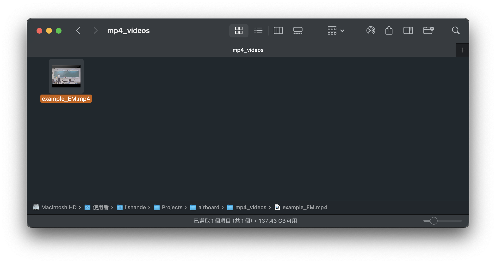
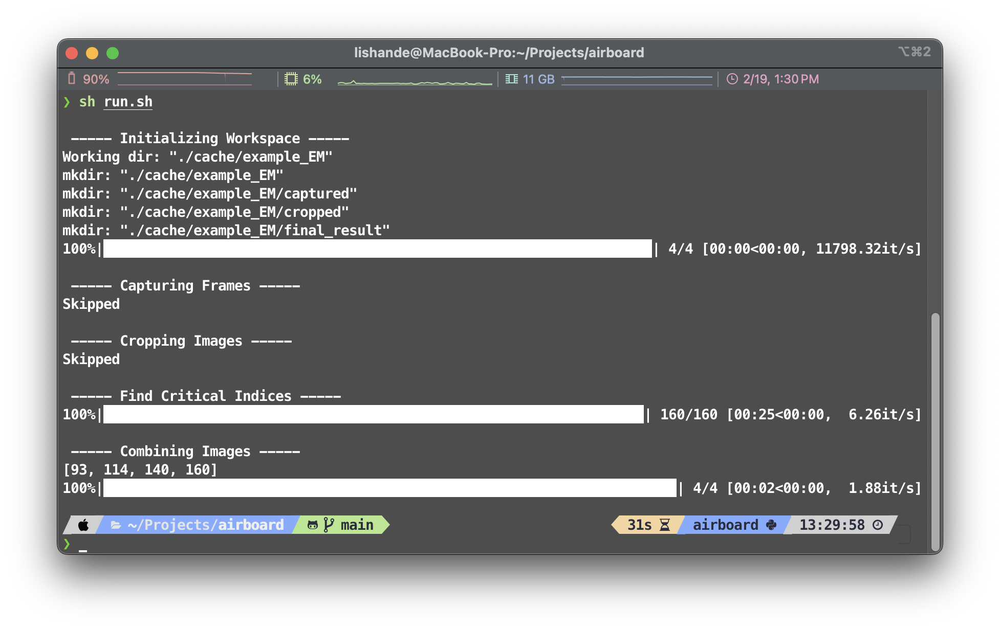
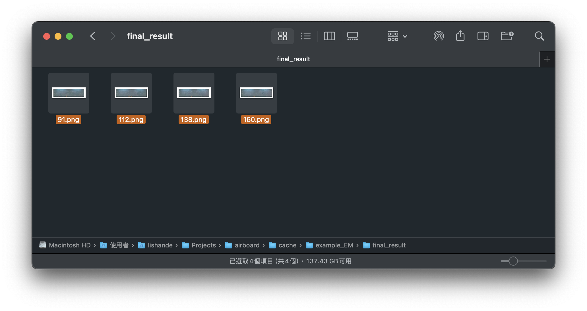
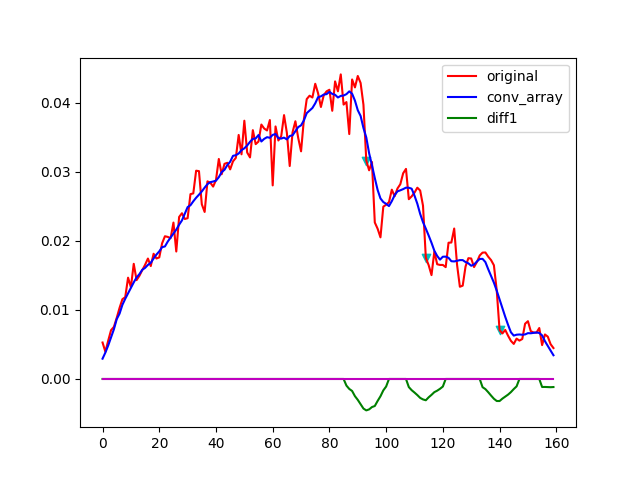
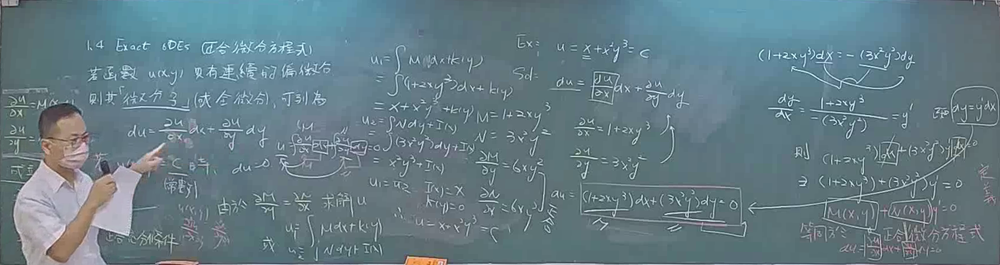

[](https://opensource.org/licenses/MIT)
# Project Airboard: Intelligent Note Capture System

## Overview
**Project Airboard** represents a cutting-edge solution in the realm of educational technology, specifically designed to enhance the learning experience through an intelligent note capture system. This project is tailored for avid learners seeking an efficient, user-friendly, and dependable method for note-taking.

## Table of Content
- [Overview](#overview)
- [Installation Guide](#Installation-Guide)
- [Demo](#Demo)
- [Features](#Features)
- [Code Example](#Code-Examples)
- [License](#License)
- [Contact Information](#Contact-Information)

## Key Features
- **Smart Capture**: Leveraging advanced algorithms, Airboard proficiently identifies optimal moments for note capture during MP4 lecture recordings. This feature ensures that the most significant content is accurately recorded, enhancing the quality and comprehensiveness of notes.
    
- **Obstacle Detection and Resolution**: Unique to Airboard is its ability to recognize and address obstacles obstructing the note-taking area. The system ingeniously utilizes multiple image sources to reconstruct and present an unobstructed, comprehensive view of the notes.
    
- **Customization and Flexibility**: At its core, Airboard is built using Python, offering a high degree of customization. Users can effortlessly adapt and modify the system to align with their specific requirements, making it a versatile tool in various educational settings.
    

## Target Audience
Project Airboard is ideally suited for students, educators, and professionals who engage with digital learning materials and seek to optimize their note-taking process.

By providing a seamless integration of technology with the learning process, Project Airboard aims to revolutionize the way we capture and interact with educational content.

---
# Installation Guide

## 1. Clone the project
```sh
git clone git@github.com:VincentLi1216/airboard.git
```

## 2. Install Python 3.11.6 or above
[Go to the Python Official Website](https://www.python.org/downloads/)

## 3. pip install virtualenv
```sh
pip install virtualenv
```

## 4. Create Virtualenv
```
virtualenv -p <path to your python 3.11.6> venv
```

## 5. Init the project
```sh
sh init.sh
```

---
# Demo
## 1. Put Your File in ./cache/mp4_videos
```
├── mp4_videos
│   └── <PUT YOUR FILE HERE>
├── utils
│   └── ...
├── venv
│   └── ...
├── main.py
│
├── ...
```


## 2. Put Corresponding Path into the Function
```python
from main import main

main("./mp4_videos/example_EM.mp4", skip_steps=["capture_frames", "crop_img"])
```

## 3. Execute the Code by "sh run.sh"


## 4. See the result
```
├── mp4_videos
│   └── ...
├── utils
│   └── ...
├── cache
│   └── <NAME OF YOUR VIDEO>
│       └──final_result
├── main.py
│
├── ...
```


---
# Features
## Corner Selector
The Corner Selector offers a user-friendly interface, enabling users to swiftly and accurately define regions of interest. With this tool, precise selection is accomplished in a single step, streamlining the user experience for enhanced productivity.

## Auto Obstacle Mask
Airboard's sophisticated obstacle recognition technology can identify obstructions in the frame and create high-precision masks. This feature facilitates the seamless combination of images, ensuring clarity and continuity in visual outputs.


## Find Critical Indices
This feature tackles the challenge of pinpointing critical frames in long videos(1 hour +). By analyzing each frame, the algorithm smartly extracts the most comprehensive and relevant notes, optimizing content assimilation from lengthy recordings.


## Combine Image
In instances where obstacles are detected, the system intelligently employs multiple images to construct the most comprehensive and unobstructed view, ensuring the integrity and completeness of visual information.



## Skippable Process
Recognizing the need for flexibility in development, the Skippable Process feature allows developers to bypass specific time-consuming tasks, facilitating efficient exploration and fine-tuning of the project.


---
# Code Examples
```python
from main import main

main("<Path to Your Video>", skip_steps=[])
# note: you can fill in ["init_workplace", "capture_frames", "crop_img", "find_critical_indices", "combine_img"] in skip_steps
```

---
# License

This project is licensed under the MIT License - see the [LICENSE](LICENSE) file for details.

---
# Contact Information
## My email
For any inquiries or further information, feel free to reach out: 
- Email: [sunnus.tw@gmail.com](mailto:sunnus.tw@gmail.com)

